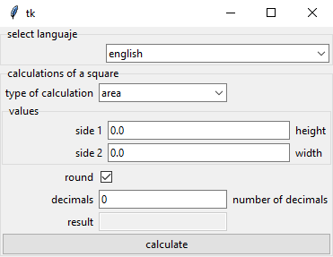

# tkinter_form

tk_form is a simple module that helps you to create forms in tkinter easily and quickly from a base dictionary, saving certain repetitive tasks in the creation of a form and adding the verification of integer and float variables. In simple words it is similar to having a tkinter variable. Its value is a dictionary.

## Install

```bash
pip install tkinter_form
```

## Tutorial

### Fast Example

```python
import tkinter as tk
from tkinter_form import Form

class App(tk.Tk):
    def __init__(self) -> None:
        super().__init__()
        estruct = {
            "high": 1.0,
            "width": 1.0,
            "round": False,
            "type of calculation": ["calculate area", "calculate perimeter"],
            "result": "",
        }
        self.form = Form(
            self,
            name_form="calculations of a rectangle",
            form_dict=estruct,
            name_config="calculate",
            button=True
        )
        self.form.pack()
        self.button = self.form.button

        self.button.config(command=self.calculate)
        self.mainloop()
    def calculate(self):
        """
        Calculate values rectangle
        """
        dict_vals = self.form.get()
        if dict_vals["type of calculation"] == "calculate area":
            value = dict_vals["high"] * dict_vals["width"]
        elif dict_vals["type of calculation"] == "calculate perimeter":
            value = 2 * dict_vals["high"] + 2 * dict_vals["width"]
        else:
            value = 0
        if dict_vals["round"]:
            value = round(value)
        result = {"result": str(value)}
        self.form.set(result)
if __name__ == "__main__":
    App()
```

With these lines we create the interface that performs the calculations of area and perimeter of a rectangle. This frees us the declaration of the labels and other objects returning a ttk.LabelFrame with the additional methods set(), get() and the attributes widgets and button.



## API Reference

### tkinter_form.Form

```python
tkinter_form.Form(self,master: object, name_form: str, form_dict: dict, name_config: str = "configure", button: bool = True)
```

Form object is a `ttk.LabelFrame`. With additional attributes: [`self.widgets`](#tkinter_formformwidgets), [`self.button`](#tkinter_formformbutton), [`self.get()`](#tkinter_formformget), [`self.set() `](#tkinter_formformset).

Parameters:

master : tk.Tk or object tk.parent
    tkinter container or parent object

name_form : str
    string with edit`ttk.LabelFrame['text']

form_dict : dict[str:float|int|str|bool|list]
    base structure of the form that contains the initial values of the form.[Struct Form](#struct-form)


name_config: str
    name of the form button in case the argument`button` is `True` button : bool Create a button on the form by default 

Attributes:

[`button`](#tkinter_formformbutton) : ttk.Button | None
    if the button is create in the form.

[`widgets`](#tkinter_formformwidgets) : dict[str:[ttk.Label,ttk.Entry|ttk.CheckButton|ttk.ComboBox] | tkinter_form.Form]
dictionary that contains the widgets of the form with the same structure of the dictionary that was built. returning a list with two objects a tk.Label and a tk object according to the data type.

[ttk.LabelFrame Atributes](https://anzeljg.github.io/rin2/book2/2405/docs/tkinter/ttk-LabelFrame.html)

Methods:

[`get()`](#tkinter_formformget): Return Dict
    Returns a dictionary with the same structure that was created which contains the values entered in the form

[`set(set_dict)`](#tkinter_formformset) : Return None
    set_dict: dict

dictionary with keys value of the base dictionary with values to set in the form

[ttk.LabelFrame Methods](https://anzeljg.github.io/rin2/book2/2405/docs/tkinter/ttk-LabelFrame.html)

#### tkinter_form.Form.button

is a ttk.buttom or None if the form button was not created

#### tkinter_form.Form.widgets

dictionary that contains the widgets of the form with the same structure of the dictionary that was built. returning a list with two objects a tk.Label and a tk object according to the data type.

##### Example

in[Fast Example](#fast-example) the widget attibute return:

```python
{
    "high": [ttk.Label, ttk.Entry],
    "width": [ttk.Label, ttk.Entry],
    "round": [ttk.Label, ttk.CheckButtom],
    "type of calculation": [ttk.Label, ttk.ComboBox],
    "result": [ttk.Label, ttk.Entry],
}
```

If in [Fast Example](#fast-example) we want the ttk.Entry result to be read-only we could:

```python
class App(tk.Tk):
    def __init__(self) -> None:
        :::
        entry = self.form.widgets["result"][1]
        entry.config(state='readonly')
```

If the structure of the form contains subdictionaries in said key, a Form will be assigned.

Estruct example:

```python
{   
    "measures":{
        "high": 1.0,
        "width": 1.0
    },
    "round": False,
    "type of calculation": ["calculate area", "calculate perimeter"],
    "result": "",
}
```

    the`widget` attribute would be

```python
{   
    "measures":tkinter_form.Form,
    "round": [ttk.Label, ttk.CheckButtom],
    "type of calculation": [ttk.Label, ttk.ComboBox],
    "result": [ttk.Label, ttk.Entry],
}
```

#### tkinter_form.Form.get()

Arguments:

Return:
    None
Returns a dictionary with the same structure that was created which contains the values entered in the form.

##### Example

    in[Fast Example](#fast-example) the get() function return:

```python
{
    "high": 3.7,
    "width": 5,
    "round": True,
    "type of calculation": "calculate perimeter",
    "result": "17",
}
```

    if struct Form Contain Subdictionaries

Estruct example:

```python
{   
    "measures":{
        "high": 1.0,
        "width": 1.0
    },
    "round": False,
    "type of calculation": ["calculate area", "calculate perimeter"],
    "result": "",
}
```

    the`get()` function return por example

```python
{   
    "measures":{
        "high": 3.7,
        "width": 5
    },
    "round": True,
    "type of calculation": "calculate perimeter",
    "result": "17",
}
```

#### tkinter_form.Form.set()

Arguments:
    set_dict : dict

Return:
    None

dictionary with keys value of the base dictionary with values to set in the form

##### Example

    in[Fast Example](#fast-example) the set() function in line 39-40:

```python
        result = {"result": str(value)}
        self.form.set(result)
```

## Struct Form

The form structure is based on a base dictionary. with some initial values that will be displayed in the interface and that determine the type of data that the entry accepts. This means that if the value in the base dictionary is an integer, the entry will only allow the entry of integer values.

- dictionary keys are recommended to be strings but not required. But care must be taken. The Form.widgets will have as keys the same values entered in the base structure.

- The comboboxes are generated by means of lists, these cannot be empty since their initial value is the first index of the list.

### Examples Structs - Result

1. example 1

```python
estruct = {
    "high": float(),
    "width": float(),
    "round": bool(),
    "type of calculation": ["val 1", "val 2"],
    "result": str(),
}
```


2. example 2

```python
estruct = {
    "measurements":{
    "high": 5.0,
    "width": float()
    },
    "round": bool(),
    "type of calculation": ["val 1", "val 2"],
    "result": str(),
}
```


3. example 2

```python
estruct = {
    "Company:": "company.SAS",
    "Fisrt Name:": "Job",
    "Last Name:": "Job",
    "Email Address:": "company.SAS",
    "Title:": "",
    "Phone:": int(),
    "Cancel Registration:": True,
    "Job Function:":["Campaing Management", "CRM Administration", "Partner", "Employee"],
    "Dietary Requirements:":str()
}
```


## Bugs

1. get() function on integer values returns the value difenter if in the Entry the value starts with zero.
   Example:

```python
estruct = {"value": int()}
```


return get()

```python
{'value': 55}
```
